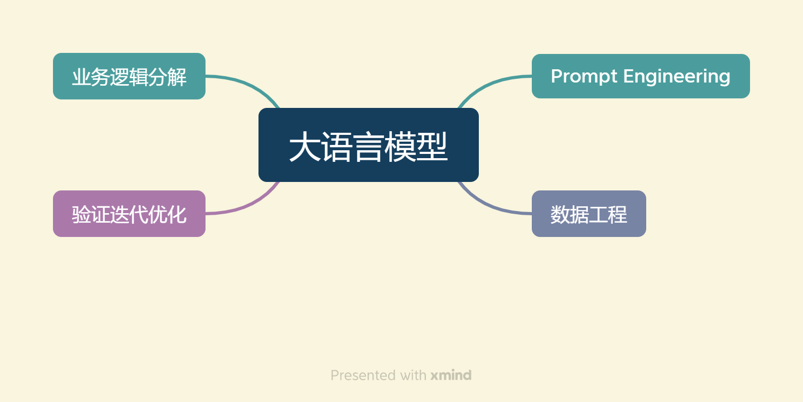
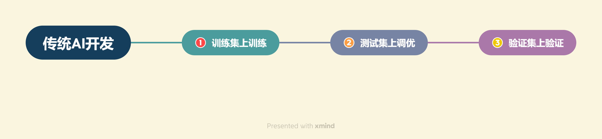
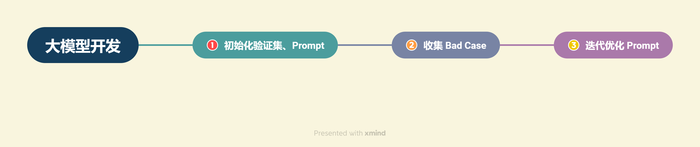
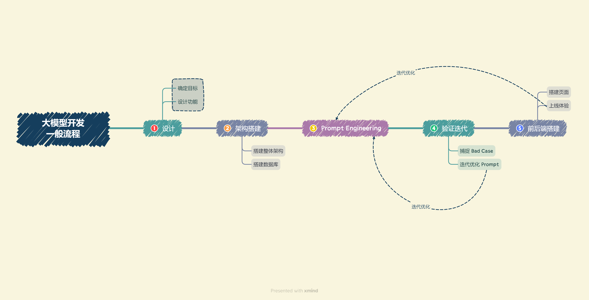
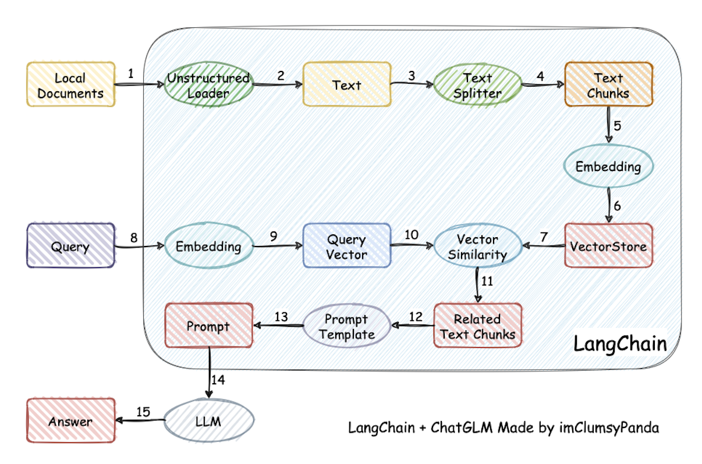

# 1-4 开发LLM应用的整体流程

### 1. 何为大模型开发

**以大语言模型为功能核心、通过大语言模型的强大理解能力和生成能力、结合特殊的数据或业务逻辑来提供独特功能的应用**称为**大模型开发**。开发大模型相关应用，其技术核心点虽然在大语言模型上，但一般通过调用 API 或开源模型来实现核心的理解与生成，通过 Prompt Enginnering 来实现大语言模型的控制，因此，大模型开发却更多是一个**工程问题，将大模型作为一个调用工具，通过 Prompt Engineering、数据工程、业务逻辑分解等手段来充分发挥大模型能力，适配应用任务**，而不会将精力聚焦在优化模型本身上。因此，作为初学者更需要**掌握使用大模型的实践技巧**。

​​

##### 1.1 传统AI与大模型的开发差别

* 传统AI

  * 复杂业务逻辑拆解，使用多个模型解决子任务
  * 针对每个模型构建训练集、验证集
  * 训练、优化模型
  * 对多个子任务的模型进行串联，形成完整链路解决业务逻辑
* 大模型

  * 通过**PromptEngineering（提示工程：根据特定任务需求优化输入提示，引导大语言模型生成更准确、全面、符合格式要求的输出，从而提升模型在多样化应用场景中的性能和实用性）** 来代替对子任务模型的训练、优化
  * 通过Prompt链路组合实现复杂的业务逻辑。用一个通用的大模型+若干业务Prompt来解决任务

##### 1.2 传统AI与大模型的评估差别

* 传统AI

  * 构造训练集、测试集、验证集
  * 在训练集、验证集上训练、优化模型、
  * 在验证集上最终验证模型效果来实现性能的评估。

​​

* 大模型

  * 从实际业务需求出发构造小批量验证集
  * 设计合理 Prompt 来满足验证集效果
  * 从业务逻辑中收集当下 Prompt 的 Bad Case，将 Bad Case 加入到验证集中，针对性优化 Prompt，最后实现较好的泛化效果

​​

### 2. 大模型开发的一般流程

​​

1. **确定目标**。在进行开发前，确定开发的目标，即要开发的应用的应用场景、目标人群、核心价值
2. **设计功能**。在确定开发目标后，需要设计本应用所要提供的功能，以及每一个功能的大体实现逻辑
3. **搭建整体架构**。目前，绝大部分大模型应用都是采用的特定数据库 + Prompt + 通用大模型的架构
4. **搭建数据库**。大模型应用需要进行向量语义检索，一般使用诸如 Chroma 的向量数据库。

    1. 收集数据并进行预处理，再向量化存储到数据库中。数据预处理一般包括从多种格式向纯文本的转化，例如 PDF、MarkDown、HTML、音视频等，以及对错误数据、异常数据、脏数据进行清洗。完成预处理后，需要进行切片、向量化构建出个性化数据库。
5. **Prompt Engineering**。优质的 Prompt 对大模型能力具有极大影响，我们需要逐步迭代构建优质的 Prompt Engineering 来提升应用性能。在该步中，我们首先应该明确 Prompt 设计的一般原则及技巧，构建出一个来源于实际业务的小型验证集，基于小型验证集设计满足基本要求、具备基本能力的 Prompt。
6. **验证迭代**。验证迭代在大模型开发中是极其重要的一步，一般指通过不断发现 Bad Case 并针对性改进 Prompt Engineering 来提升系统效果、应对边界情况。在完成上一步的初始化 Prompt 设计后，我们应该进行实际业务测试，探讨边界情况，找到 Bad Case，并针对性分析 Prompt 存在的问题，从而不断迭代优化，直到达到一个较为稳定、可以基本实现目标的 Prompt 版本。
7. **前后端搭建**。完成 Prompt Engineering 及其迭代优化之后，我们就完成了应用的核心功能，可以充分发挥大语言模型的强大能力。接下来我们需要搭建前后端，设计产品页面，让我们的应用能够上线成为产品。前后端开发是非常经典且成熟的领域，此处就不再赘述，我们采用 Gradio 和 Streamlit，可以帮助个体开发者迅速搭建可视化页面实现 Demo 上线。
8. **体验优化**。在完成前后端搭建之后，应用就可以上线体验了。接下来就需要进行长期的用户体验跟踪，记录 Bad Case 与用户负反馈，再针对性进行优化即可。

### 3.搭建LLM项目的流程简析

项目原理：

1. 加载本地文档
2. 读取文本
3. 文本分割
4. 文本向量化
5. question向量化
6. 在文本向量中匹配出与问句向量最相似的 top k 个
7. **匹配出的文本作为上下文和问题一起添加到 Prompt 中**
8. 提交给 LLM 生成回答

​​

1. 项目目标：基于个人知识库的问答助手
2. 核心功能

    1. 爬取总结的md文档以及用户上传文档向量化，创建知识库
    2. 检索用户提问的知识片段
    3. 提供提问、检索片段，获取大模型回答
    4. 流式回复
    5. 历史对话记录
3. 技术架构和工具

    1. 框架：LangChain
    2. Embedding模型：CPT、智谱、M3E
    3. 数据库：Chroma
    4. 大模型：GPT、讯飞星火、文心一言、GLM等
    5. 前后端：Gradio和streamlit
4. 数据准备与向量数据库构建

    1. 收集整理文档
    2. 文档词向量化
    3. 将向量化后的文档导入 Chroma 知识库，建立知识库索
5. 集成大模型，配置API
6. 构建提示工程，实现大模型问答。实现流式回复以及历史对话记录
7. 验证评估，收集BaseCode并进行优化
8. 前端与用户交互界面开发
9. 维护与持续改进

‍
