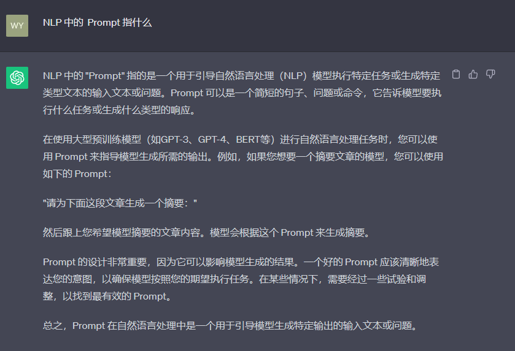

# 2-1 LLM基本概念

### 1. Prompt

	Prompt 最初是 NLP（自然语言处理）研究者为下游任务设计出来的**一种任务专属的输入模板**，类似于一种任务（例如：分类，聚类等）会对应一种 Prompt。每一次访问大模型的输入为一个 Prompt，而大模型给我们的返回结果则被称为 Completion。例如下图，给 ChatGPT 的提问 “NLP 中的 Prompt 指什么”是 Prompt，而 ChatGPT 的返回结果就是此次的 Completion。

​​

### 2. Temperature

	LLM 生成是具有随机性的，在模型的顶层通过选取不同预测概率的预测结果来生成最后的结果。通过控制 temperature 参数来控制 LLM 生成结果的随机性与创造性。Temperature 一般取值在 0\~1 之间。

* 当取值较低接近 0 时：预测的**随机性会较低**，产生更保守、可预测的文本
* 当取值较高接近 1 时：预测的**随机性会较高**，所有词被选择的可能性更大，会产生更有创意、多样化的文本

	对于不同的问题与应用场景，需要设置不同的 temperature。

* 搭建的个人知识库助手项目中，将 temperature 设置为 0，从而保证助手对知识库内容的稳定使用，规避错误内容、模型幻觉
* 在个性化 AI、创意营销文案生成等场景中，更需要创意性，从而更倾向于将 temperature 设置为较高的值。

### 3. System Prompt

	System Prompt 是随着 ChatGPT API 开放并逐步得到大量使用的一个新兴概念，**它并不在大模型本身训练中得到体现，而是大模型服务方为提升用户体验所设置的一种策略**。具体来说，在使用 ChatGPT API 时，可以设置两种 Prompt：

*  System Prompt：该种 Prompt 内容会在整个会话过程中持久地影响模型的回复，且相比于普通 Prompt 具有更高的重要性
* User Prompt：偏向于我们平时提到的 Prompt，即需要模型做出回复的输入

	当需要一个幽默风趣的个人知识库助手，并向这个助手提问我今天有什么事时，可以构造如下的 Prompt：

```undefined
{
    "system prompt": "你是一个幽默风趣的个人知识库助手，可以根据给定的知识库内容回答用户的提问，注意，你的回答风格应是幽默风趣的",
    "user prompt": "我今天有什么事务？"
}
```

‍
