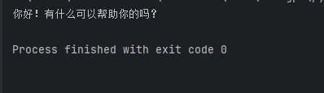
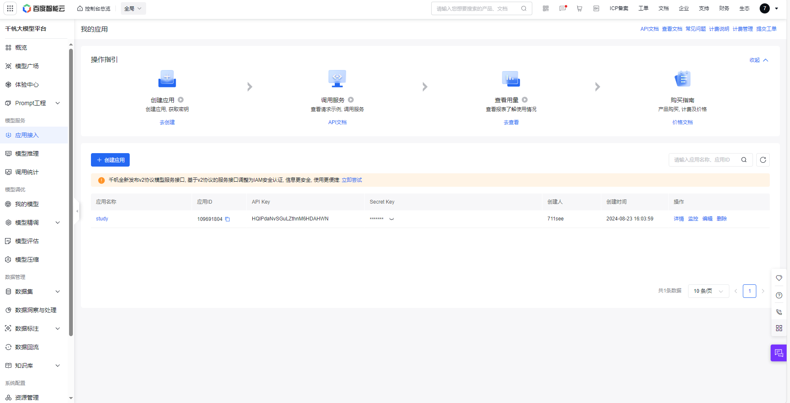
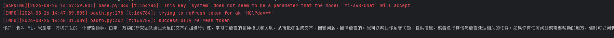
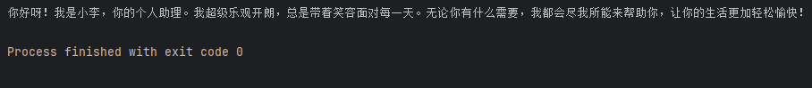
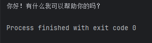
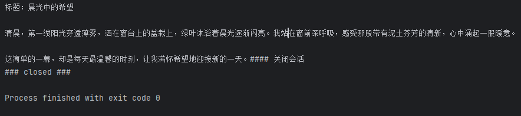
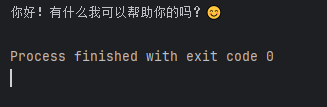

# 2-2 LLM API使用

### 1. ChatGPT

* 配置OpenAI API key

  * openAI官网注册号码，被手机号拦截了
  * 使用[OpenAI API - F2API](https://f2api.com/product/openai)

```python
# -*- coding: utf-8 -*-
# @Time    : 2024/8/23 14:48
# @Author  : Shining
# @File    : openai_api.py
# @Description :

import os
from dotenv import find_dotenv,load_dotenv
# 将从上面网址获取的api key 存入.env文件中
# 读取本地/项目环境变量
_ = load_dotenv(find_dotenv())

# 设置代理
# os.environ['HTTPS_PROXY'] = 'http://127.0.0.1:7890'
# os.environ["HTTP_PROXY"] = 'http://127.0.0.1:7890'

from openai import OpenAI

# 注意：需要将base_url进行替换替换
client = OpenAI(
    api_key=os.environ.get("OPENAI_API_KEY"),
    base_url="https://api.f2gpt.com"
)

# completion = client.chat.completions.create(
#     model="gpt-3.5-turbo",
#     messages=[
#         # System Prompt
#         {"role": "system", "content": "You are a helpful assistant."},
#         # User Prompt
#         {"role": "user", "content": "Hello!"}
#     ]
# )
#
# print(completion.choices[0].message.content)

def get_gpt_messages(prompt):
    """
    :param prompt: 输入
    :return: 请求参数prompt
    """
    messages = [
        {"role":"user","content":prompt}
    ]
    return messages

def get_gpt_completion(prompt,model="gpt-3.5-turbo",temperature=0):
    """
    :param prompt: 输入
    :param model: 使用模型
    :param temperature: 温度系数
    :return: 模型输出
    """

    response = client.chat.completions.create(
        model=model,
        messages=get_gpt_messages(prompt),
        temperature=temperature
    )
    if len(response.choices) > 0:
        return response.choices[0].message.content
    return "generate answer error"

print(get_gpt_completion("你好"))
```

​​

### 2. 千帆SDK

* [百度智能云控制台 (baidu.com)](https://console.bce.baidu.com/qianfan/ais/console/applicationConsole/application/v1?_=1724654706478&redirect=https://console.bce.baidu.com/qianfan/ais/console/applicationConsole/application/v1)
* 使用基于v1协议的服务接口，v2版本服务接口调整为了IAM安全认证
* 创建应用，获取API Key与Secret Key

​​

```python
# -*- coding: utf-8 -*-
# @Time    : 2024/8/23 15:32
# @Author  : Shining
# @File    : qianfan_api.py
# @Description :

# https://console.bce.baidu.com/qianfan/overview

from dotenv import find_dotenv,load_dotenv

_ = load_dotenv(find_dotenv())

import qianfan

def gen_qianfan_messages(prompt):
    """
    :param prompt: 输入
    :return: 请求参数
    """
    messages = [{"role": "user", "content": prompt}]
    return messages

def get_qianfan_completion(prompt,model="Yi-34B-Chat",temperature=0.01):
    """
    :param prompt:
    :param model:
    :param temperature:
    :return:
    """

    chat_completion = qianfan.ChatCompletion()
    messages = gen_qianfan_messages(prompt)
    response = chat_completion.do(
        messages=messages,
        model=model,
        temperature=temperature,
        system="你是一名乐观开朗的个人助理-小李"
    )
    return response["result"]

if __name__ == '__main__':
    result = get_qianfan_completion("你好！请介绍一下自己！")
    print(result)

```

	在代码中设置了system prompt，告知模型名字，但是在最终的结果中可以看到，该模型的效果并不好。千帆目前只有 **Prompt模板 、Yi-34B-Chat 和 Fuyu-8B公有云在线调用体验服务**这三个服务是免费调用的。如果想体验其他的模型服务，需要在计费管理处开通相应模型的付费服务才能体验。

​​

### 3. ERNIE SDK

* [飞桨AI Studio星河社区-人工智能学习与实训社区 (baidu.com)](https://aistudio.baidu.com/index/accessToken)
* 使用 ERNIE SDK 中的 ERNIE Bot 来调用文心一言。ERNIE Bot 能够调用文心大模型的强大功能，涵盖了文本创作、通用对话、语义向量以及AI作图等多个基础功能。ERNIE SDK 并不像 千帆 SDK 那样支持各种大语言模型， 而是只支持百度自家的文心大模型。目前 ERNIE Bot 支持的模型有：

  * ernie-3.5               文心大模型（ernie-3.5）
  * ernie-lite              文心大模型（ernie-lite）
  * ernie-4.0               文心大模型（ernie-4.0）
  * ernie-longtext          文心大模型（ernie-longtext）
  * ernie-speed             文心大模型（ernie-speed）
  * ernie-speed-128k        文心大模型（ernie-speed-128k）
  * ernie-tiny-8k           文心大模型（ernie-tiny-8k）
  * ernie-char-8k           文心大模型（ernie-char-8k）
  * ernie-text-embedding    文心百中语义模型
  * ernie-vilg-v2           文心一格模型
* 创建应用，获取API Key与Secret Key

```python
# -*- coding: utf-8 -*-
# @Time    : 2024/8/23 16:07
# @Author  : Shining
# @File    : ernie_api.py
# @Description :

from dotenv import find_dotenv,load_dotenv

_ = load_dotenv(find_dotenv())

import erniebot
import os

erniebot.api_type = "aistudio"
erniebot.access_token = os.environ.get("EB_ACCESS_TOKEN")

def gen_wenxin_messages(prompt):
    """
    :param prompt: 输入
    :return: 请求参数
    """
    messages = [{"role": "user", "content": prompt}]
    return messages

def get_wenxin_completion(prompt,model="ernie-3.5",temperature=0.01):
    """
    :param prompt:
    :param model:
    :param temperature:
    :return:
    """

    chat_completion = erniebot.ChatCompletion()
    messages = gen_wenxin_messages(prompt)
    response = chat_completion.create(
        messages=messages,
        model=model,
        temperature=temperature,
        system="你是一名乐观开朗的个人助理-小李"
    )
    return response["result"]

if __name__ == '__main__':
    result = get_wenxin_completion("你好！请介绍一下自己！")
    print(result)
```

	可以看到，该模型的效果要优于从千帆SDK中调用的模型

​​

### 4. 讯飞星火

* [Datawhale](https://xinghuo.xfyun.cn/sparkapi?ch=dwKeloHY) 提供的专属链接，点击免费试用
* [控制台-讯飞开放平台 (xfyun.cn)](https://console.xfyun.cn/services/bm35)获取APPID，APISecret，APIKey

```python
# -*- coding: utf-8 -*-
# @Time    : 2024/8/23 16:35
# @Author  : Shining
# @File    : spark_api.py
# @Description :


from dotenv import find_dotenv,load_dotenv

_ = load_dotenv(find_dotenv())

import os
from sparkai.llm.llm import ChatSparkLLM, ChunkPrintHandler
from sparkai.core.messages import ChatMessage

def gen_spark_params(model):
    """
    :param model: 使用模型
    :return: 请求参数
    """

    spark_url_tpl = "wss://spark-api.xf-yun.com/{}/chat"
    model_params_dict = {
        # v1.5 版本
        "v1.5": {
            "domain": "general", # 用于配置大模型版本
            "spark_url": spark_url_tpl.format("v1.1") # 云端环境的服务地址
        },
        # v2.0 版本
        "v2.0": {
            "domain": "generalv2", # 用于配置大模型版本
            "spark_url": spark_url_tpl.format("v2.1") # 云端环境的服务地址
        },
        # v3.0 版本
        "v3.0": {
            "domain": "generalv3", # 用于配置大模型版本
            "spark_url": spark_url_tpl.format("v3.1") # 云端环境的服务地址
        },
        # v3.5 版本
        "v3.5": {
            "domain": "generalv3.5", # 用于配置大模型版本
            "spark_url": spark_url_tpl.format("v3.5") # 云端环境的服务地址
        }
    }
    return model_params_dict[model]

def gen_spark_messages(prompt):
    """
    :param prompt: 提示词
    :return: 请求参数
    """
    messages = [ChatMessage(role="user", content=prompt)]
    return messages


def get_completion(prompt, model="v3.5", temperature=0.1):
    """
    :param prompt: 提示词
    :param model: 模型 默认3.5
    :param temperature: 温度系数
    :return:
    """
    spark_llm = ChatSparkLLM(
        spark_api_url=gen_spark_params(model)["spark_url"],
        spark_app_id=os.environ["SPARKAI_APP_ID"],
        spark_api_key=os.environ["SPARKAI_API_KEY"],
        spark_api_secret=os.environ["SPARKAI_API_SECRET"],
        spark_llm_domain=gen_spark_params(model)["domain"],
        temperature=temperature,
        streaming=False,
    )
    messages = gen_spark_messages(prompt)
    handler = ChunkPrintHandler()
    # 当 streaming设置为 False的时候, callbacks 并不起作用
    response = spark_llm.generate([messages], callbacks=[handler])
    return response

if __name__ == '__main__':
    response = get_completion("你好")
    result = response.generations[0][0].text
    print(result)
```

​​

	除了上述通过SDK来调用，也可以使用WebSocket来对模型进行调用

* Python [调用示例](https://xfyun-doc.xfyun.cn/lc-sp-sparkAPI-1709535448185.zip)为例进行讲解，下载后我们可以得到一个 sparkAPI.py 文件，文件中包含了服务端封装和客户端调用的实现
* 注释掉sparkAPI中的openpyxl行，代码中并未使用到
* 修改on_close函数

```python
# 收到 websocket 关闭的处理
def on_close(ws, close_status_code, close_msg):  
    print("### closed ###")
```

* 将密钥传入main函数参数，运行sparkAPI.py

​​

### 5. 智谱GLM

* https://open.bigmodel.cn/overview
* 进图控制台，查看API密钥

```python
# -*- coding: utf-8 -*-
# @Time    : 2024/8/26/026 15:21
# @Author  : Shining
# @File    : glm_api.py
# @Description :

from dotenv import find_dotenv,load_dotenv

_ = load_dotenv(find_dotenv())

def gen_glm_params(prompt):
    """
    :param prompt: 提示词
    :return: 请求参数
    """
    messages = [{"role": "user", "content": prompt}]
    return messages

import os
from zhipuai import ZhipuAI

client = ZhipuAI(
    api_key=os.environ["ZHIPUAI_API_KEY"]
)


def get_completion(prompt, model="glm-4", temperature=0.95):
    """
    :param prompt: 提示词
    :param model: 模型
    :param temperature: 温度系数
    :return:
    """
    messages = gen_glm_params(prompt)
    response = client.chat.completions.create(
        model=model,
        messages=messages,
        temperature=temperature
    )
    if len(response.choices) > 0:
        return response.choices[0].message.content
    return "generate answer error"

if __name__ == '__main__':
    result = get_completion("你好！")
    print(result)
```

​​

‍

‍

**注意：上述使用过程中，并没有详细的列出如何获取key或者接口的调用文档，如有需要，可到各自的官网看一下官方的文档进行调用。**
