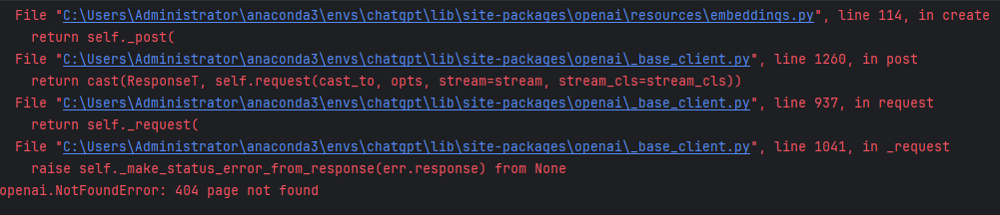
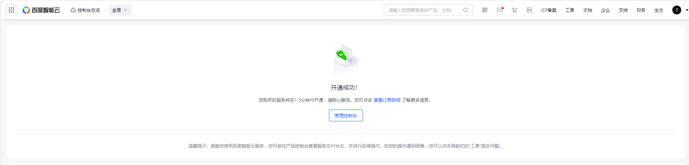
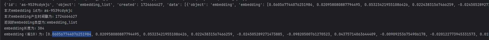
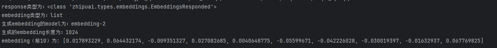

# 3-2 embedding API使用

### 1. OpenAI API

	GPT embedding有封装好的接口，目前有三种模式，性能如下所示：

|模型|页/美元|MTEB|MIRACL|
| ------------------------| ---------| ------| --------|
|text-embedding-3-large|9615|54.9|64.6|
|text-embedding-3-small|62500|62.3|44.0|
|text-embedding-ada-002|12500|61.0|31.4|

* MTEB得分为embedding model分类、聚类、配对等八个任务的平均得分。
* MIRACL得分为embedding model在检索任务上的平均得分。

```python
# -*- coding: utf-8 -*-
# @Time    : 2024/8/26/026 17:04
# @Author  : Shining
# @File    : openai_api.py
# @Description :

import os
from openai import OpenAI
from dotenv import load_dotenv, find_dotenv


# 读取本地/项目的环境变量。
_ = load_dotenv(find_dotenv())

# 设置代理
os.environ['HTTPS_PROXY'] = 'http://127.0.0.1:7890'
os.environ["HTTP_PROXY"] = 'http://127.0.0.1:7890'

def openai_embedding(text: str, model: str=None):
    # OPENAI_API_KEY
    api_key = os.environ['OPENAI_API_KEY']
    client = OpenAI(api_key=api_key,base_url="https://api.f2gpt.com")

    # 三种模式：'text-embedding-3-small', 'text-embedding-3-large', 'text-embedding-ada-002'
    if model == None:
        model="text-embedding-ada-002"

    response = client.embeddings.create(
        input=text,
        model=model
    )
    return response


if __name__ == '__main__':
    response = openai_embedding(text='要生成 embedding 的输入文本，字符串形式。')
    print(response)
```

	报错404，估计原因是没有使用官方的API url所导致

​​

### 2. 千帆API

* 在使用之前需要开通embedding服务（新注册用户有20元代金券）

​​

```python
# -*- coding: utf-8 -*-
# @Time    : 2024/8/26/026 17:10
# @Author  : Shining
# @File    : wenxin_api.py
# @Description :


from dotenv import find_dotenv,load_dotenv
import json
import os
import requests

_ = load_dotenv(find_dotenv())

def wenxin_embedding(text: str):
    api_key = os.environ['QIANFAN_AK']
    secret_key = os.environ['QIANFAN_SK']

    # 使用API Key、Secret Key向https://aip.baidubce.com/oauth/2.0/token 获取Access token
    url = "https://aip.baidubce.com/oauth/2.0/token?grant_type=client_credentials&client_id={0}&client_secret={1}".format(
        api_key, secret_key)
    payload = json.dumps("")
    headers = {
        'Content-Type': 'application/json',
        'Accept': 'application/json'
    }
    response = requests.request("POST", url, headers=headers, data=payload)
    # 通过获取的Access token 来embedding text
    url = "https://aip.baidubce.com/rpc/2.0/ai_custom/v1/wenxinworkshop/embeddings/embedding-v1?access_token=" + str(
        response.json().get("access_token"))
    input = []
    input.append(text)
    payload = json.dumps({
        "input": input
    })
    headers = {
        'Content-Type': 'application/json'
    }

    response = requests.request("POST", url, headers=headers, data=payload)
    return json.loads(response.text)


# text应为List(string)
text = "要生成 embedding 的输入文本，字符串形式。"
response = wenxin_embedding(text=text)

print('本次embedding id为：{}'.format(response['id']))
print('本次embedding产生时间戳为：{}'.format(response['created']))
print('返回的embedding类型为:{}'.format(response['object']))
print('embedding长度为：{}'.format(len(response['data'][0]['embedding'])))
print('embedding（前10）为：{}'.format(response['data'][0]['embedding'][:10]))
```

​​

### 3. 智谱API

```python
# -*- coding: utf-8 -*-
# @Time    : 2024/8/26/026 17:31
# @Author  : Shining
# @File    : zhipu_api.py
# @Description :


from dotenv import find_dotenv,load_dotenv
import os

_ = load_dotenv(find_dotenv())

from zhipuai import ZhipuAI
def zhipu_embedding(text: str):
    api_key = os.environ['ZHIPUAI_API_KEY']
    client = ZhipuAI(api_key=api_key)
    response = client.embeddings.create(
        model="embedding-2",
        input=text,
    )
    return response

text = '要生成 embedding 的输入文本，字符串形式。'
response = zhipu_embedding(text=text)

print(f'response类型为：{type(response)}')
print(f'embedding类型为：{response.object}')
print(f'生成embedding的model为：{response.model}')
print(f'生成的embedding长度为：{len(response.data[0].embedding)}')
print(f'embedding（前10）为: {response.data[0].embedding[:10]}')
```

​​
