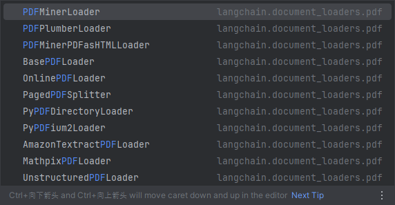

# 3-3 数据处理

### 1. 原文档选取

[中华人民共和国民法典](https://www.yunfu.gov.cn/yfwgdlt/attachment/0/23/23458/1408572.pdf)

### 2. 数据读取

##### 2.1 PDF

	LangChain中有多种PDF的loader，使用PyMuPDFLoader 来读取知识库的 PDF 文件。PyMuPDFLoader 是 PDF 解析器中速度最快的一种，结果会包含 PDF 及其页面的详细元数据，并且每页返回一个文档。

​​

	文档加载后储存在pad_pages变量中，变量类型为List

```python
# -*- coding: utf-8 -*-
# @Time    : 2024/8/26/026 17:37
# @Author  : Shining
# @File    : data_loader.py
# @Description :

"""
PDF
"""

from langchain.document_loaders.pdf import PyMuPDFLoader

pdf_loader = PyMuPDFLoader("中华人民共和国民法典.pdf")
pdf_pages = pdf_loader.load()

print(pdf_pages)
```

	pdf_pages中的每一元素为一页文档，变量类型为langchain\_core.documents.base.Document, 文档变量类型包含两个属性

* page_content：该页文档的内容。
* meta_data：该页文档相关的描述性数据。

```python
pdf_page = pdf_pages[0]
print(f"每一个元素的类型：{type(pdf_page)}.",
    f"该文档的描述性数据：{pdf_page.metadata}",
    f"查看该文档的内容:\n{pdf_page.page_content}",
    sep="\n------\n")
```

​​

##### 2.2 MD文档

	MD文档的读取方法与pdf基本相似，不再赘述

### 3. 数据清洗

	在知识库的数据尽量是**有序的、优质的、精简的**，因此需要删除低质量的、甚至影响理解的文本数据。  
可以看到上文中读取的pdf文件不仅将一句话按照原文的分行添加了换行符`\n`​，也在原本两个符号中间插入了`\n`​，我们可以使用正则表达式匹配并删除掉`\n`​。
