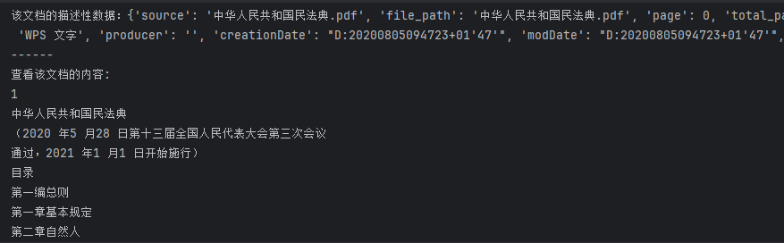

# 3-3 数据处理

### 1. 原文档选取

[中华人民共和国民法典](https://www.yunfu.gov.cn/yfwgdlt/attachment/0/23/23458/1408572.pdf)

### 2. 数据读取

##### 2.1 PDF

	LangChain中有多种PDF的loader，使用PyMuPDFLoader 来读取知识库的 PDF 文件。PyMuPDFLoader 是 PDF 解析器中速度最快的一种，结果会包含 PDF 及其页面的详细元数据，并且每页返回一个文档。

​​

	文档加载后储存在pad_pages变量中，变量类型为List

```python
# -*- coding: utf-8 -*-
# @Time    : 2024/8/26/026 17:37
# @Author  : Shining
# @File    : data_loader.py
# @Description :

"""
PDF
"""

from langchain.document_loaders.pdf import PyMuPDFLoader

pdf_loader = PyMuPDFLoader("中华人民共和国民法典.pdf")
pdf_pages = pdf_loader.load()

print(pdf_pages)
```

	pdf_pages中的每一元素为一页文档，变量类型为langchain\_core.documents.base.Document, 文档变量类型包含两个属性

* page_content：该页文档的内容。
* meta_data：该页文档相关的描述性数据。

```python
pdf_page = pdf_pages[0]
print(f"每一个元素的类型：{type(pdf_page)}.",
    f"该文档的描述性数据：{pdf_page.metadata}",
    f"查看该文档的内容:\n{pdf_page.page_content}",
    sep="\n------\n")
```

​​

##### 2.2 MD文档

	MD文档的读取方法与pdf基本相似，不再赘述

### 3. 数据清洗

	在知识库的数据尽量是**有序的、优质的、精简的**，因此需要删除低质量的、甚至影响理解的文本数据。  
	可以看到读取到的pdf内容包含了不应出现的页码以及因pdf文档格式而出现的换行符

​​

​​

	需要对读取到的文档做两个操作：

* 去除开头的页码以及换行符
* 去除除第*节、第*条以外的换行符*

```python
# -*- coding: utf-8 -*-
# @Time    : 2024/8/26/026 17:37
# @Author  : Shining
# @File    : data_loader.py
# @Description :

"""
PDF
"""

from langchain.document_loaders.pdf import PyMuPDFLoader

pdf_loader = PyMuPDFLoader("中华人民共和国民法典.pdf")
pdf_pages = pdf_loader.load()

pdf_page = pdf_pages[21]

import re

"""
查看原本数据\n的分布情况:
    1.每一页pdf在读取时，在开头存在页码
    2.保留第一节 第一条 第字前面的换行符
"""
print(pdf_page.page_content)
print(repr(pdf_page.page_content))

pattern = re.compile(r'[$\d]', re.DOTALL)
pdf_page.page_content = re.sub(pattern, "", pdf_page.page_content)
pattern = re.compile(r'[$\d]', re.DOTALL)
pdf_page.page_content = re.sub(pattern, "", pdf_page.page_content)
pattern = re.compile(r'[$\d]', re.DOTALL)
pdf_page.page_content = re.sub(pattern, "", pdf_page.page_content)

pattern = re.compile(r'(\n)[$\u4e00-\u7b2b,\u7b2d-\u9fff]', re.DOTALL)
pdf_page.page_content = re.sub(pattern, "", pdf_page.page_content)
print(pdf_page.page_content)
print(repr(pdf_page.page_content))


# print(type(pdf_page.page_content))
# print(repr(pdf_page.page_content))
# print(pdf_page.page_content)

# print(f"每一个元素的类型：{type(pdf_page)}.",
#     f"该文档的描述性数据：{pdf_page.metadata}",
#     f"查看该文档的内容:\n{pdf_page.page_content}",
#     sep="\n------\n")
```

​​

### 4. 文档分割

	模型所支持的上下文是有限度的，过长的文档存入检索数据库会导致检索得到的知识太长超出模型的处理能力。因此，在构建向量知识库的过程中，需要对文档进行分割，将单个文档按长度或者按固定的规则分割成若干个**chunk**，然后将每个 chunk 转化为词向量，存储到向量数据库中。

	在进行检索时，以**chunk**作为检索的元单位，也就是每一次检索到k个chunk作为模型可以参考来回答用户问题的知识（k的大小可自由设定）

	Langchain中文本分割器都根据**chunk_size(块大小)** 和**chunk_overlap(块与块之间的重叠大小)** 进行分割。

* chunk\_size：每个块包含的字符或Token（如单词、句子等）的数量
* chunk\_overlap：两个块之间共享的字符数量，用于保持上下文的连贯性，避免分割丢失上下文信息

​​

	Langchain 提供多种文档分割方式，区别在怎么确定块与块之间的边界、块由哪些字符/token组成、以及如何测量块大小：

* RecursiveCharacterTextSplitter()：按字符串分割文本，递归地尝试按不同的分隔符进行分割文本。

  * ```python
    # -*- coding: utf-8 -*-
    # @Time    : 2024/8/27/027 17:13
    # @Author  : Shining
    # @File    : splitter.py
    # @Description :


    from langchain.text_splitter import RecursiveCharacterTextSplitter

    from data_loader import pdf_pages

    # 知识库单段文字长度
    CHUNK_SIZE = 100
    # 知识库相邻文本重合长度
    OVERLAP_SIZE = 10

    # 使用递归字符文本分割器
    text_splitter = RecursiveCharacterTextSplitter(
        # separators=["\u7b2c"],
        chunk_size=CHUNK_SIZE,
        chunk_overlap=OVERLAP_SIZE
    )


    # split_docs = text_splitter.split_documents(pdf_pages)
    split_docs = text_splitter.split_text(pdf_pages[20].page_content[0:500])
    print(len(split_docs))
    print(split_docs)
    ```
  * ​​
* CharacterTextSplitter()：按字符来分割文本。
* MarkdownHeaderTextSplitter()：基于指定的标题来分割markdown 文件。
* TokenTextSplitter()：按token来分割文本。
* SentenceTransformersTokenTextSplitter()：按token来分割文本
* Language()：用于 CPP、Python、Ruby、Markdown 等。
* NLTKTextSplitter()：使用 NLTK（自然语言工具包）按句子分割文本。
* SpacyTextSplitter()：使用 Spacy按句子的切割文本。

	注意：如**何对文档进行分割**，其实是数据处理中**最核心的一步**，其往往决定了检索系统的下限。但是，如何选择**分割方式**，往往**具有很强的业务相关性**——针对不同的业务、不同的源数据，往往需要设定个性化的文档分割方式。
