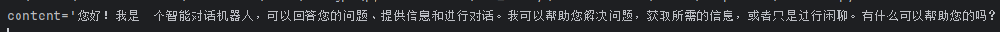
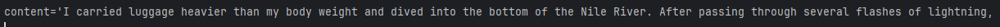
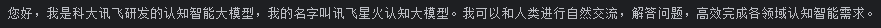
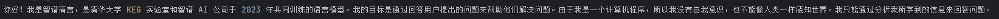

# 4-1 LLM接入LangChain

	LangChain虽然接入了OpenAI等的embedding模型，但却没有接入所有的模型。类似的，LangChain也内置了OpenAI，LLMA等大模型的接口，却没有内置市面上所有的大模型，同样允许用户通过自定义LLM类来进行扩展。

### 1. 基于LangChain调用ChatGPT

##### 1.1 model（模型）

```python
# -*- coding: utf-8 -*-
# @Time    : 2024/8/28/028 9:57
# @Author  : Shining
# @File    : ChatGPT.py
# @Description :


from dotenv import find_dotenv,load_dotenv
from langchain_openai import ChatOpenAI
import openai
import os

# 获取api key
_ = load_dotenv(find_dotenv())
open_api_key = os.environ.get("OPENAI_API_KEY")


"""
model="gpt-4o",
temperature=0,
max_tokens=None,
timeout=None,
max_retries=2,
# api_key="...",
# base_url="...",
# organization="...",
# other params...
"""
llm = ChatOpenAI(model="gpt-3.5-turbo",temperature=0,api_key=open_api_key,base_url="https://api.f2gpt.com")

output = llm.invoke("请介绍一下自己！")
print(output)
```

​​

##### 1.2 prompt（提示模板）

	大多数情况下不会直接将用户的输入直接传递给LLM，通常会将用户输入添加到一个较大的文本中，称为**提示模板（该文本提供有关当前特定任务的附加上下文**） 

	聊天模型的接口是基于消息（message），而不是原始的文本。prompt不仅包含了输入内容信息，也包含了每条message的信息(角色、在列表中的位置等)。通常情况下，一个**ChatPromptTemplate**是一个**ChatMessageTemplate**的列表。每个**ChatMessageTemplate**包含格式化该聊天消息的说明（其角色以及内容）。

```python
# -*- coding: utf-8 -*-
# @Time    : 2024/8/28/028 9:57
# @Author  : Shining
# @File    : ChatGPT.py
# @Description :


from dotenv import find_dotenv,load_dotenv
from langchain_core.prompts import ChatPromptTemplate,ChatMessagePromptTemplate
from langchain_openai import ChatOpenAI
import os

# 获取api key
_ = load_dotenv(find_dotenv())
open_api_key = os.environ.get("OPENAI_API_KEY")


"""
model="gpt-4o",
temperature=0,
max_tokens=None,
timeout=None,
max_retries=2,
# api_key="...",
# base_url="...",
# organization="...",
# other params...
"""
llm = ChatOpenAI(model="gpt-3.5-turbo",temperature=0,api_key=open_api_key,base_url="https://api.f2gpt.com")

# output = llm.invoke("请介绍一下自己！")
# print(output)

system_template = "你是一个翻译助手，可以帮助我将 {input_language} 翻译成 {output_language}."
human_template = "{text}"

chat_prompt = ChatPromptTemplate.from_messages([
    ("system", system_template),
    ("human", human_template)
])

text = "我带着比身体重的行李，\
游入尼罗河底，\
经过几道闪电 看到一堆光圈，\
不确定是不是这里。\
"
messages = chat_prompt.format_messages(input_language="中文", output_language="英文", text=text)
output = llm.invoke(messages)
print(output)
```

​​

##### 1.3 output parser（输出解析器）

	输出解析器将语言模型的原始输出转换为可以在下游使用的格式，有几种主要类型：

* 将LLM文本转换为结构化信息（例如 JSON）
* 将ChatMessage转换为字符串
* 将除消息之外的调用返回的额外信息（如 OpenAI 函数调用）转换为字符串

##### 1.4 完整流程

* 获取输入变量，将变量传递给提示模板以创建提示
* 将提示传递给语言模型
* 通过（可选）输出解析器传递输出

	使用**LCEL**语法快速实现上述流程（LCEL（一种新的语法，是LangChain工具包的重要补充，使得我们处理LangChain和代理更加简单方便。）

* LCEL提供了异步、批处理和流处理支持
* LCEL拥有后备措施，解决LLM格式输出的问题。
* LCEL增加了LLM的并行性，提高了效率。
* LCEL内置了日志记录，有助于理解复杂链条和代理的运行情况。

```python
# -*- coding: utf-8 -*-
# @Time    : 2024/8/28/028 10:41
# @Author  : Shining
# @File    : chain.py
# @Description :

# -*- coding: utf-8 -*-
# @Time    : 2024/8/28/028 9:57
# @Author  : Shining
# @File    : ChatGPT.py
# @Description :


from dotenv import find_dotenv,load_dotenv
from langchain_core.output_parsers import StrOutputParser
from langchain_core.prompts import ChatPromptTemplate
from langchain_openai import ChatOpenAI
import os

# 获取api key
_ = load_dotenv(find_dotenv())
open_api_key = os.environ.get("OPENAI_API_KEY")

system_template = "你是一个翻译助手，可以帮助我将 {input_language} 翻译成 {output_language}."
human_template = "{text}"

chat_prompt = ChatPromptTemplate.from_messages([
    ("system", system_template),
    ("human", human_template)
])

llm = ChatOpenAI(model="gpt-3.5-turbo",temperature=0,api_key=open_api_key,base_url="https://api.f2gpt.com")

text = "我带着比身体重的行李，\
游入尼罗河底，\
经过几道闪电 看到一堆光圈，\
不确定是不是这里。\
"
messages = chat_prompt.format_messages(input_language="中文", output_language="英文", text=text)
# output = llm.invoke(messages)

output_parser = StrOutputParser()
# output = output_parser.invoke(output)

chain = chat_prompt | llm | output_parser
output = chain.invoke({"input_language":"中文", "output_language":"英文","text": text})
print(output)
```

### 2 LangChain调用百度文心一言

##### 2.1 直接调用

```python
# -*- coding: utf-8 -*-
# @Time    : 2024/8/28/028 10:48
# @Author  : Shining
# @File    : wenxin.py
# @Description :


# from dotenv import find_dotenv, load_dotenv
# from langchain_community.llms import QianfanLLMEndpoint
# import os
#
# _ = load_dotenv(find_dotenv())
# QIANFAN_AK = os.environ["QIANFAN_AK"]
# QIANFAN_SK = os.environ["QIANFAN_SK"]
#
# llm = QianfanLLMEndpoint(model="Yi-34B-Chat",streaming=True)
# output = llm("你好，请介绍一下自己！")
# print(output)
```

##### 2.2 自定义LLM

	该部分参考LangChain的[官方文档](https://python.langchain.com/v0.1/docs/modules/model_io/llms/custom_llm/)实现，继承LLM类实现以下方法：

* _call：实现传入提示词生成message、生成对话、完成问答等核心的功能
* _llm_type：返回字符串的属性，仅用于记录日志

以上两条方法为必须实现的方法

```python
from typing import Any, Dict, Iterator, List, Optional

from langchain_core.callbacks.manager import CallbackManagerForLLMRun
from langchain_core.language_models.llms import LLM

import qianfan


class WenxinLLM(LLM):
    model: str = "Yi-34B-Chat"
    # 温度系数
    temperature: float = 0.1
    # API_Key
    api_key: str = None
    # Secret_Key
    secret_key: str = None
    # 系统消息
    system: str = None

    def _call(self,prompt: str,stop: Optional[List[str]] = None,
        run_manager: Optional[CallbackManagerForLLMRun] = None,**kwargs: Any,) -> str:
        def gen_wenxin_messages(prompt):
            messages = [{"role": "user", "content": prompt}]
            return messages

        chat_comp = qianfan.ChatCompletion(ak=self.api_key,sk=self.secret_key)
        message = gen_wenxin_messages(prompt)

        resp = chat_comp.do(messages=message,
                            model=self.model,
                            temperature=self.temperature,
                            system=self.system)

        return resp["result"]

    @property
    def _llm_type(self) -> str:
        return "wenxin"

    @property
    def _identifying_params(self) -> Dict[str, Any]:
        return {"model_name": "CustomChatModel",
        }

llm = WenxinLLM(api_key=QIANFAN_AK, secret_key=QIANFAN_SK, system="你是一个助手！")
output = llm.invoke("你好，请介绍一下自己！")
print(output)
```

### 3. LangChain调用讯飞星火

	需要注意一下版本，选择已经开通的服务进行调用

```python
# -*- coding: utf-8 -*-
# @Time    : 2024/8/28/028 11:22
# @Author  : Shining
# @File    : spark.py
# @Description :

from dotenv import find_dotenv,load_dotenv
import os

_ = load_dotenv(find_dotenv())
IFLYTEK_SPARKAI_APP_ID = os.environ.get("IFLYTEK_SPARKAI_APP_ID")
IFLYTEK_SPARKAI_API_SECRET = os.environ.get("IFLYTEK_SPARKAI_API_SECRET")
IFLYTEK_SPARKAI_API_KEY = os.environ.get("IFLYTEK_SPARKAI_API_KEY")

def gen_spark_params(model):
    spark_url_tpl = "wss://spark-api.xf-yun.com/{}/chat"
    model_params_dict = {
        # v1.5 版本
        "v1.5": {
            "domain": "general", # 用于配置大模型版本
            "spark_url": spark_url_tpl.format("v1.1") # 云端环境的服务地址
        },
        # v2.0 版本
        "v2.0": {
            "domain": "generalv2", # 用于配置大模型版本
            "spark_url": spark_url_tpl.format("v2.1") # 云端环境的服务地址
        },
        # v3.0 版本
        "v3.0": {
            "domain": "generalv3", # 用于配置大模型版本
            "spark_url": spark_url_tpl.format("v3.1") # 云端环境的服务地址
        },
        # v3.5 版本
        "v3.5": {
            "domain": "generalv3.5", # 用于配置大模型版本
            "spark_url": spark_url_tpl.format("v3.5") # 云端环境的服务地址
        }
    }
    return model_params_dict[model]

from langchain_community.llms import SparkLLM

spark_api_url = gen_spark_params(model="v3.5")["spark_url"]
# Load the model(默认使用 v3.0)
llm = SparkLLM(
    spark_api_url=spark_api_url,
    spark_app_id=IFLYTEK_SPARKAI_APP_ID,
    spark_api_key=IFLYTEK_SPARKAI_API_KEY,
    spark_api_secret=IFLYTEK_SPARKAI_API_SECRET
               )  #指定 v1.5版本
res = llm("你好，请你自我介绍一下！")
print(res)
```

​​

##### 1.4 LangChain调用智谱GLM

	通过LangChain框架来调用智谱 AI 大模型，但是其提供的[ChatGLM](https://python.langchain.com/docs/integrations/llms/chatglm)已不可用，因此需要自定义一个LLM。

```python
# -*- coding: utf-8 -*-
# @Time    : 2024/8/28/028 14:02
# @Author  : Shining
# @File    : zhipu.py
# @Description :

from typing import Any, List, Mapping, Optional, Dict
from langchain_core.callbacks.manager import CallbackManagerForLLMRun
from langchain_core.language_models.llms import LLM
from zhipuai import ZhipuAI

import os

from dotenv import find_dotenv,load_dotenv
import os

_ = load_dotenv(find_dotenv())
ZHIPUAI_API_KEY = os.environ.get("ZHIPUAI_API_KEY")

class ZhipuAILLM(LLM):
    # 默认选用 glm-4
    model: str = "glm-4"
    # 温度系数
    temperature: float = 0.1
    # API_Key
    api_key: str = None

    def _call(self, prompt: str, stop: Optional[List[str]] = None,
              run_manager: Optional[CallbackManagerForLLMRun] = None,
              **kwargs: Any):
        client = ZhipuAI(
            api_key=self.api_key
        )

        def gen_glm_params(prompt):
            messages = [{"role": "user", "content": prompt}]
            return messages

        messages = gen_glm_params(prompt)
        response = client.chat.completions.create(
            model=self.model,
            messages=messages,
            temperature=self.temperature
        )

        if len(response.choices) > 0:
            return response.choices[0].message.content
        return "generate answer error"

    # 首先定义一个返回默认参数的方法
    @property
    def _default_params(self) -> Dict[str, Any]:
        """获取调用API的默认参数。"""
        normal_params = {
            "temperature": self.temperature,
        }
        # print(type(self.model_kwargs))
        return {**normal_params}

    @property
    def _llm_type(self) -> str:
        return "Zhipu"

    @property
    def _identifying_params(self) -> Mapping[str, Any]:
        """Get the identifying parameters."""
        return {**{"model": self.model}, **self._default_params}

zhipuai_model = ZhipuAILLM(model = "glm-4", temperature = 0.1, api_key = ZHIPUAI_API_KEY)
print(zhipuai_model("你好，请你自我介绍一下！"))
```

​​

‍

‍
