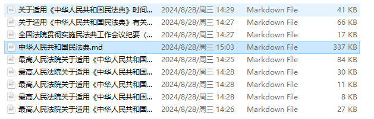
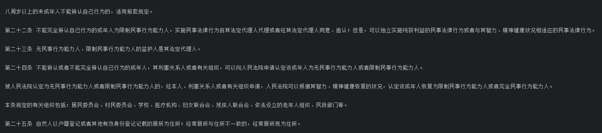

# 4-2 构建检索问答链

	在3-4 搭建并使用向量数据库中，介绍了如何根据本地的文档搭建向量数据库。这里再次根据新增的本地文档，完成向量数据库的搭建。后续将使用搭建好的向量数据库，对查询的问题进行召回并相结合构建prompt，提供给大模型进行回答。

### 1. 搭建向量数据库

##### 1.1 数据处理

* 选取文档（选取了民法典以及其相关的解释）

  * 中华人民共和国民法典
  * 全国法院贯彻实施民法典工作会议纪要（法〔2021〕94号）
  * 关于适用《中华人民共和国民法典》时间效力的若干规定（法释〔2020〕15号）及理解与适用
  * 关于适用《中华人民共和国民法典》有关担保制度的解释（法释〔2020〕28号）及答记者问
  * 最高人民法院关于适用《中华人民共和国民法典》合同编通则若干问题的解释（法释〔2023〕13号）及答记者问
  * 最高人民法院关于适用《中华人民共和国民法典》婚姻家庭编的解释（一）（法释〔2020〕22号）
  * 最高人民法院关于适用《中华人民共和国民法典》总则编若干问题的解释（法释〔2022〕6号）及答记者问
  * 最高人民法院关于适用《中华人民共和国民法典》物权编的解释（一）（法释〔2020〕24号）
  * 最高人民法院关于适用《中华人民共和国民法典》继承编的解释（一）（法释〔2020〕23号）.md

​​

* 数据读取

  从读取道德数据来看，需要去除多余的\n换行符，也就是从（\\n\n->\n）

  ​​

* 数据清洗（去除多余的\n换行符）
* 数据分割（采用了递归的字符分割）

  实际现实的效果来说，并未达到预期，后续会重新定义数据分割的规则，目前首先将整体流程走通，看看构建的问答链效果

```python
# -*- coding: utf-8 -*-
# @Time    : 2024/8/28/028 14:40
# @Author  : Shining
# @File    : dataloader.py
# @Description :


from langchain.document_loaders.pdf import PyMuPDFLoader
from langchain.document_loaders.markdown import UnstructuredMarkdownLoader
from langchain_text_splitters import RecursiveCharacterTextSplitter
import os
import re

class DataLoader(object):
    def __init__(self,source_root):
        self.source_root = source_root
        self.file_paths = self._get_file_paths()
        self.loaders = self._create_loaders()
        self.docs = self._load_docs()
        self.wash_docs = self._wash_datas()

        # 实际应用中 在不同的任务中 使用不同的分割器至关重要
        self.spliter = RecursiveCharacterTextSplitter(
            separators=[
                "\n\n",
                "\n",
                "\u7b2b"
                " ",
                "",
            ],
            chunk_size=200,
            chunk_overlap=20,
            length_function=len,
            is_separator_regex=False
        )
        self.split_docs = self._split_datas()

    def __call__(self, *args, **kwargs):
        pass

    # 获取所有本地文档路径
    def _get_file_paths(self):
        file_paths = []
        for item in os.scandir(self.source_root):
            file_paths.append(item.path)
        return file_paths

    # 根据文档类型创建数据加载器
    def _create_loaders(self):
        loaders = []
        for file_path in self.file_paths:
            if file_path.endswith("pdf"):
                loaders.append(PyMuPDFLoader(file_path))
            elif file_path.endswith("md"):
                loaders.append(UnstructuredMarkdownLoader(file_path))
        return loaders

    # 加载数据 [<class 'langchain_core.documents.base.Document'>]
    def _load_docs(self):
        docs = []
        for loader in self.loaders:
            docs.extend(loader.load())
        return docs

    # 清洗文档 将\n\n替换为\n
    def _wash_datas(self):
        for doc in self.docs:
            pattern = re.compile(r'(\n\n)', re.DOTALL)
            doc.page_content = re.sub(pattern, "\n", doc.page_content)
        return self.docs
    # 切分文档
    def _split_datas(self):
        split_docs = self.spliter.split_documents(self.docs)
        return split_docs

if __name__ == '__main__':
    dataloader = DataLoader(r"C:\llm_study\lll-universe\codes\chapter-4\QA-chain\resource")
    split_docs = dataloader.split_docs
    for split_doc in split_docs:
        print(split_doc)
```

##### 1.2 构建向量数据库

* 构建向量数据库

  * 封装智谱的embedding接口

    ```python
    # -*- coding: utf-8 -*-
    # @Time    : 2024/8/28/028 16:17
    # @Author  : Shining
    # @File    : embedding.py
    # @Description :


    import logging
    from typing import Dict, List, Any

    from langchain.embeddings.base import Embeddings
    from langchain.pydantic_v1 import BaseModel, root_validator

    logger = logging.getLogger(__name__)

    class ZhipuAIEmbeddings(BaseModel, Embeddings):
        client: Any

        @root_validator()
        def validate_environment(cls, values: Dict) -> Dict:
            from zhipuai import ZhipuAI
            values["client"] = ZhipuAI()
            return values

        def embed_query(self, text: str) -> List[float]:
            embeddings = self.client.embeddings.create(
                model="embedding-2",
                input=text
            )
            return embeddings.data[0].embedding

        def embed_documents(self, texts: List[str]) -> List[List[float]]:
            return [self.embed_query(text) for text in texts]
    ```
  * 构建向量数据库

    ```python
    # -*- coding: utf-8 -*-
    # @Time    : 2024/8/28/028 16:25
    # @Author  : Shining
    # @File    : dattaset.py
    # @Description :

    from dataloader import DataLoader
    from embedding import ZhipuAIEmbeddings

    from dotenv import find_dotenv,load_dotenv
    from langchain.vectorstores.chroma import Chroma

    _ = load_dotenv(find_dotenv())

    resource_path = r"C:\llm_study\lll-universe\codes\chapter-4\QA-chain\resource"
    database_path = r"C:\llm_study\lll-universe\codes\chapter-4\QA-chain\db"

    dataloader = DataLoader(resource_path)
    embedding = ZhipuAIEmbeddings()
    vectordb = Chroma.from_documents(
        dataloader.split_docs,
        embedding=embedding,
        persist_directory=database_path
    )
    vectordb.persist()
    print(f"向量库中存储的数量：{vectordb._collection.count()}")
    ```

### 2. 加载向量数据库

```python
def load_database(database_path=r"C:\llm_study\lll-universe\codes\chapter-4\QA-chain\db",embedding=ZhipuAIEmbeddings()):
    vectordb = Chroma(
        persist_directory=database_path,  # 允许我们将persist_directory目录保存到磁盘上
        embedding_function=embedding
    )
    return vectordb
```

### 3. 创建LLM

```python
# -*- coding: utf-8 -*-
# @Time    : 2024/8/28/028 16:46
# @Author  : Shining
# @File    : llm.py
# @Description :


# -*- coding: utf-8 -*-
# @Time    : 2024/8/28/028 14:02
# @Author  : Shining
# @File    : zhipu.py
# @Description :

from typing import Any, List, Mapping, Optional, Dict
from langchain_core.callbacks.manager import CallbackManagerForLLMRun
from langchain_core.language_models.llms import LLM
from zhipuai import ZhipuAI

class ZhipuAILLM(LLM):
    # 默认选用 glm-4
    model: str = "glm-4"
    # 温度系数
    temperature: float = 0.01
    # API_Key
    api_key: str = None

    def _call(self, prompt: str, stop: Optional[List[str]] = None,
              run_manager: Optional[CallbackManagerForLLMRun] = None,
              **kwargs: Any):
        client = ZhipuAI(
            api_key=self.api_key
        )

        def gen_glm_params(prompt):
            messages = [{"role": "user", "content": prompt}]
            return messages

        messages = gen_glm_params(prompt)
        response = client.chat.completions.create(
            model=self.model,
            messages=messages,
            temperature=self.temperature
        )

        if len(response.choices) > 0:
            return response.choices[0].message.content
        return "generate answer error"

    # 首先定义一个返回默认参数的方法
    @property
    def _default_params(self) -> Dict[str, Any]:
        """获取调用API的默认参数。"""
        normal_params = {
            "temperature": self.temperature,
        }
        # print(type(self.model_kwargs))
        return {**normal_params}

    @property
    def _llm_type(self) -> str:
        return "Zhipu"

    @property
    def _identifying_params(self) -> Mapping[str, Any]:
        """Get the identifying parameters."""
        return {**{"model": self.model}, **self._default_params}
```

### 4. 构建问答链

* 用户提出问题
* 向量数据库检索相关文档或上下文
* LLM模型根据检索到的内容与提问生成答案
* 返回答案以及检索的内容（启用return_source_documents）
* ```python
  template = '''使用以下上下文来回答最后的问题。如果你不知道答案，就说你不知道，不要试图编造答案。最多使用三句话。尽量使答案简明扼要。{context}问题: {question}'''
      QA_CHAIN_PROMPT = PromptTemplate(input_variables=["context","question"],template=template)
      qa_chain = RetrievalQA.from_chain_type(llm,retriever=vectordb.as_retriever(),return_source_documents=True,chain_type_kwargs={"prompt": QA_CHAIN_PROMPT})

  question = "什么是民法典？"
      result = qa_chain({"query":question})
      print(result["result"])
  ```

测试了两个问题，问答链的效果看起来还不错

​​

​​

### 5. 添加历史对话记忆功能

	现在实现了通过上传本地知识文档，保存到向量知识库，通过将查询问题与向量知识库的召回结果进行结合输入到 LLM 中，得到一个相比于直接让LLM回答要好得多的结果。

	同时还有一个关键问题 - **这个问答链并不记得之前的交流内容**。

##### 5.1 记忆

	使用**ConversationBufferMemory**将先前的对话嵌入到语言模型中，使其具有连续对话的能力 ，保存聊天消息历史记录的列表，这些历史记录将在回答问题时与问题一起传递给聊天机器人，从而将其添加到上下文中。下面将简单使用，更多的Memory的使用，包括保留指定对话轮数、保存指定 token 数量、保存历史对话的总结摘要等内容，请参考官方文档。

##### 5.2 对话检索连

	对话检索链（ConversationalRetrievalChain）在检索问答链的基础上，增加了处理对话历史的能力。

* 将之前的对话与新问题合并生成一个完整的查询语句。
* 在向量数据库中搜索该查询的相关文档。
* 获取结果后,存储所有答案到对话记忆区。
* 用户可在UI中查看完整的对话流程。

这种链式方式将新问题放在之前对话的语境中进行检索，可以处理依赖历史信息的查询。并保留所有信 息在对话记忆中，方便追踪。

```python
memory = ConversationBufferMemory(
        memory_key="chat_history",  # 与 prompt 的输入变量保持一致。
        return_messages=True  # 将以消息列表的形式返回聊天记录，而不是单个字符串
    )

    qa = ConversationalRetrievalChain.from_llm(
        llm,
        retriever=vectordb.as_retriever(),
        memory=memory
    )


    question = "那我应该如何获得民法典的主要内容？"
    result = qa({"question":question})
    print(result["answer"])
```

‍
