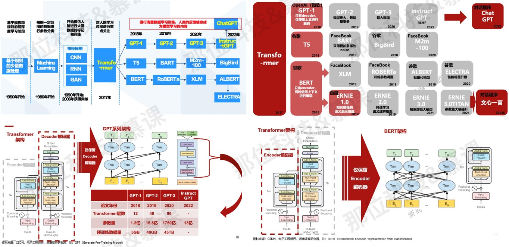

# chapter-1-大模型基础

### 1 模型训练基础

‍

##### 1 基本原理

* pipeline

  ​​
* 模型

  对真实数据的拟合

  ​​
* 任务

  * 回归：根据x预测y的值
  * 分类

    * 多分类：预测x在不同类别上的概率
    * 多标签分类：根据x预测标签是否为标签
  * 时序：**递归**的预测结果
  * 无监督
  * ......

##### **2 from scratch**

* 数据 

  ​​
* 模型
* 训练

  * 损失函数
  * 优化器

##### 3 整体视角

* 定义目标

  将现实问题抽象到已有的技术框架内，找到合适的优化目标
* 构建模型

  选择合适的模型，理解每个模块和操作，能够根据需求合理的修改模型的结构。但是在LLM时代，特别是应用层面，这种情况在发生改变。
* 处理数据

  优质的算法=80%的数据+20%的模型

‍

### 2 CUDA并行基础（简单介绍）

##### 1 基本原理

* 基本结构

  ​​

  ​​
* 内存模型

  ​​

  ​​

‍

##### 2 case study

* 矩阵乘法

  ​​

##### 3 SIMD与分布式

* 分布式

  在分布式系统中，没有共享内存，通过消息传递进行互相的通信
* SIMD

  多个处理器同时执行分配的多个任务（同一指令多数据），内存可以共享或分布式

‍

### 3 大模型进化路线

* 基于**传统神经网络**的语言模型：早期的大语言模型主要是基于传统的神经网络结构，如循环神经网络（RNN）、长短时记忆网络（LSTM）等。这些模型的**参数量较小，难以处理大规模语料库和复杂的语言结构**。
* 基于 **Transformer** 的预训练模型：使用 Transformer 模型来构建大规模预训练语言模型,包括 GPT、BERT 等，通过在**大规模语料库上进行预训练**，可以学习到丰富的语言知识和表示。
* 基于**自监督学习的预训练模型**：为了进一步提高预训练语言模型的性能，使用自监督学习来构建预训练模型。这些模型包括 BERT、RoBERTa、XLNet 等， 通过使用自监督任务来训练模型，可以更好地学习到语言结构和表示。

​​

​​

##### 1 Transformer系列的演化

​​

* Transformer：Transformer 模型人于 2017 年提出，用于机器翻译任务。它引入了**自注意力机制（self-attention）** ，通过对输入序列中的不同位置进行关注权重的计算，实现了对序列中不同位置的信息交互和建模。
* BERT：BERT（Bidirectional Encoder Representations from Transformers）由 Google 于  2018 年提出的预训练语言模型。BERT 在 Transformer 的基础上**引入了双向编码器**，通过在**大规模未标注数据**上进行预训练，学习到了丰富的语言表示。BERT 在多个 NLP 任务上取得了显著的性能提升，并成为后续模型改进的基础。
* GPT：GPT（Generative Pre-trained Transformer）是由 OpenAI 于 2018 年提 出的预训练语言模型。GPT 采用了**单向的 Transformer 解码器结构**，通过在大规模语料上进行预训练， 实现了对文本生成任务的优秀表现。
* XLNet：XLNet 是由 Google 于 2019 年提出的预训练语言模型。XLNet 采用了**自回归和自编码两种训练方式**，通过解决自回归模型中的顺序偏置问题，提高了模型的泛化能 力和生成 能力
* T5：T5（Text-to-Text Transfer Transformer）是由 Google 于 2020 年提出的通用预训练模 型。T5 通过**将不同的 NLP 任务转化为文本到文本的转换问题**，并在大规模数据 上进行预训练，实现了多任务学习和迁移学习。 以上提到的模型 有许多基  的进 步改进 变体 如 / LLM行业领军大佬 带你转型大语言模型算法工程师 / LLM 进化路线与现状【学习辅导笔记】  码两种训练方式，通过解决自回归模型中的顺序偏置问题，提高了模型的泛化能 力和生成能力。
* 除了以上提到的模型，还有许多基于 Transformer 的进一步改进和变体，如 BERT 的改进版  本 RoBERTa、GPT 的改进版本 GPT-2 和 GPT-3 等。这些模型的演化推动了自 然语言处理领域的发展，并在多个任务上取得了突破性的成果。

##### 2 大规模语言模型发展历程

​​

* Word2Vec：在 2013 年，Google 提出了 Word2Vec 模型，它是一个基于神经网络的词向量表示方法。Word2Vec 通过训练一个浅层神经网络来学习词语的分布式表示，为后续的语言模型发展奠定了基础。
* RNN 和 LSTM：循环神经网络（RNN）和长短时记忆网络（LSTM）是在自然语言处理领域中常用的序列建模工具。它们具有记忆能力，能够处理变长序列数 据，并在机器翻译、语言生成等任务中取得了一定的成功。
* Transformer：Transformer 模型是由 Vaswani 等人于 2017 年提出的一种基于自 注意力机制的深度神经网络架构。Transformer 摒弃了传统的循环结构，引入了自注意力机制，使模型能够同时处理输入序列中的所有位置信息。这一模型在机器翻译任务中取得了显著的性能提升，并成为后续大规模语言模型发展的基石。
* GPT 系列：GPT（Generative Pre-trained Transformer）系列是由 OpenAI 推出 的一系列预训练语言模型。GPT 模型通过在大规模文本数据上进行预训练，学习 到了丰富的语言表示，可以用于文本生成、问答系统等任务。
* BERT 和 Transformer-XL：

  * BERT（Bidirectional Encoder Representations from Transformers）是由 Google 于 2018 年提出的预训练语言模型。BERT 引入了双向编码器，通过在大规模未标注数据上进行预训练，学习到了更全面的上下文信息。
  * Transformer-XL是由 Dai 等人于 2019 年提出的改进版本，通过引入循环机 制解决了长序列建模时的问题。
* T5 和 GPT-3：

  * T5（Text-to-Text Transfer Transformer）是由 Google 于 2020 年提出的多任务预训练语言模型。T5 通过在大规模数据上进行预训练，并采用文本到文本转换的方式解决多种 NLP 任务
  * Transformer-XL是由 Dai 等人于 2019 年提出的改进版本，通过引入循环机制解决了长序列建模时的问题。

##### 3 大模型发展主要方向

​​

* 预训练模型：预训练模型是指**在大规模未标注数据上进行训练**的模型，通过学习语言的统计规律和语义信息，可以学习到更加丰富的语言表示。目前，预训练模 型已经成为自然语言处理领域的热点研究方向，包括 BERT、GPT 等。

  * 自然语言理解（NLU）：旨在理解和解析自然语言文本，将**文本转化为结构化的语义表示或者进行语义理解**。

    * 文本分类模型：这类模型用于将文本分类到不同的类别或标签，如情感分析、主题分类等。常见的预训练模型有 BERT、ULMFiT 等。
    * 命名实体识别模型：这类模型用于识别文本中的命名实体，如人名、地名、机构名等。常见的预训练模型有 BERT、ELMo 等。
    * 语义角色标注模型：这类模型用于识别句子中的语义角色，如施事者、受事者、 时间等。常见的预训练模型有 BERT、GPT 等。
    * 问答模型：这类模型用于回答用户提出的问题，常见的预训练模型有 BERT、GP T 等。
  * 自然语言生成（NLG）：旨在**根据给定的输入信息生成自然语言文本**。

    * 语言模型：这类模型用于生成连贯流畅的文本，如文章、对话等。常见的预训练 模型有GPT、XLNet 等。
    * 机器翻译模型：这类模型用于将一种语言翻译成另一种语言。常见的预训练模型有Transformer 等。
    * 文本摘要模型：这类模型用于生成输入文本的摘要或概括。常见的预训练模型有 BERT、GPT 等。
    * 对话生成模型：这类模型用于生成对话系统中的回复或者聊天内容。常见的预训 练模型有GPT、DialoGPT 等
* 多任务学习：多任务学习是指在**同一模型中同时学习多个任务**，通过共享参数和特征表示，可以提高模型的泛化能力和效率。多任务学习已经被应用于自然语言处理、计算机视觉等领域，取得了一定的成功。
* 迁移学习：迁移学习是指**将已经学习到的知识迁移到新的任务中**，以提高模型的 性能。迁移学习已经被广泛应用于自然语言处理、计算机视觉等领域，如使用预训练模型进行微调、使用迁移学习进行跨语种翻译等。
* 自监督学习：自监督学习是指利用无监督的方式来生成标签或者目标，以替代传统的有监督学习方法。自监督学习已经被应用于自然语言处理、计算机视觉等领 域，如使用掩码语言模型进行预训练等。
* 模型压缩和加速：随着大模型的出现，模型压缩和加速成为了一个重要的研究方向。这些方法包括知识蒸馏、剪枝、量化、分布式训练等，可以在保持模型性能 的同时，降低模型的计算和存储成本。 根据面向的任务类型，

### 4 涌现能力

​​

论文：**Emergennt Abilities of Large Language Models**

* 背景：涌现能力是指在大模型上出现但在小模型上缺乏的能力。随着深度学习和大规模预训练模型的发展，研究人员发现一些有趣的现象和能力，这些能力在小模型上无法观察到，只有**当模型规模达到一定阈值时才会显现出来**。
* 原理：涌现能力的原理可以解释为**大模型具备更多的参数和复杂性，使得它们能够从海量的训练数据中学习到更多的知识和规律**。这些大模型通过 few-shot prompting（少样本启发）的方式，即给定极少量的示例或提示，就能够执行特定的任务。 大模型通过预训练阶段学习了大量的语言知识和语义关系，这使得它们具备了更好的语言理解和生成能力。当面临新任务时，通过 fine-tuning（微调）或特定的提示，大模型可以利用其内部所学到 的知识和上下文来执行任务。这种能力在小模型上是无法观察到的，因为小模型的参数较少，学习能力有限。
* 现象：当模型规模达到一定阈值后，其效果会显著改善。在阈值之前，大模型的表现 可能与随机相差无几，但一旦超过该阈值，涌现能力会逐渐显现。 这种现象表明了大模型通过规模扩展来获得更强大的学习和推理能力。随着模型规模的增加，大模型可以学习到更多的语言知识、语义关系和上下文信息，从而在执行任务时展现出更高的准确性和灵活性。
* 总结：**量变引起质变**

### 5 灾难性遗忘

	灾难性遗忘（Catastrophic Forgetting）问题是指**在模型进行新任务学习时，会忘记之前已经学习到的知识或技能的现象**。当模型在进行新任务的训练时，为了适应新任务的要求，模型会调整参数， 但这可能导致之前学习到的知识被覆盖或丢失，从而造成对先前任务的性能下降或遗忘。 灾难性遗忘问题在持续学习或增量学习的场景中尤为突出。当模型需要不断适应新的数据和任务时，它需要在保留旧任务知识的同时，学习新任务的知识。然而，由于参数调整和优化的限制，模型很容易忘记先前任务的特征表示或冲突。 为了缓解灾难性遗忘问题：

* 弹性权重共享（Elastic Weight Consolidation）：通过在损失函数中引入正则化项，使得模型更加稳定，减少对先前任务的影响。
* 增量学习（Incremental Learning）：将新任务与旧任务分开训练，通过冻结旧任务的参数或引入记忆缓冲区来保留旧任务的知识。
* 动态权重分配（Dynamic Weight Allocation）：根据任务重要性动态调整权重， 以平衡新旧任务之间的影响。

### 6 大模型本质

* 语言模型目标：建模**自然语言的概率分布**。词汇表V上的语言模型，由函数P(w1w2...wm)表示，可以形式化地构建为词序列w1w2...wm的概率分布，表示词序列w1w2...wm作为一个句子出现的可能性大小。 由于联合概率P(w1w2...wm)的参数量十分巨大，直接计算P(w1w2...wm)非常困难。
* 可进一步假设任意单词wi出现的概率只与过去n−1个词相关，使用前馈神经网络对P(wi|wi−n+1...wi−1)进行估计

​​

### 7 训练过程

	大规模语言模型的构建流程主要包含以下四个阶段：

* 预训练(Pretraining)阶段：在预训练阶段，需要利用海量的训练数据来构建一个基础的大模型。这些数据可以包括互联网网页、维基百科、书籍、GitHub、论文、 问答网站等多样性的内容。通过预训练，模型能够学习到语言的统计规律和语义关系，并具备语言生成能力。在预训练过程中，模型可以根据输入的提示词(Prompt)来生成补全句子。
* 有监督微调(Supervised Fine-tuning)阶段：在有监督微调阶段，使用标注数据集对预训练的模型进行微调。标注数据集可以是包含输入和对应输出的配对数据， 例如机器翻译任务中的源语言句子和目标语言句子。通过有监督微调，模型可以 进一步优化并适应特定任务的需求。
* 奖励建模(Reward Modeling)阶段：在奖励建模阶段，使用强化学习方法来进一步 提升模型性能。通过定义适当的奖励函数和环境，模型可以通过与环境交互来学习更好的生成策略。这个阶段的目标是通过奖励信号来引导模型生成更加准确和合理的文本。
* 强化学习(Reinforcement Learning)阶段：在强化学习阶段，模型通过与环境进行交互，并根据环境给出的奖励信号来不断优化自身。这个阶段可以帮助模型进一 步提升生成质量和多样性。然而，强化学习需要更多的计算资源和时间来进行训练。

##### 1 无监督预训练

	首先，我们了解下什么是监督学习，无监督学习，自监督学习

* 监督学习：使用有标签的数据集来训练模型，模型通过**学习输入和对应的输出之间的关系**，以便能够对新的输入进行准确的预测或分类。例如，我们可以使用有标签的猫和狗图片数据集来训练一个模型，使其能够在给定新的图片时，准确地预测它是猫还是狗。
* 无监督学习：使用无标签的数据集进行训练，模型的目标是**发现数据中的隐藏结构、模式或关系，而不需要事先知道数据的标签**。例如，我们可以使用无标签的用户电影评分数据进行聚类，以便发现具有相似评分模式的用户群体和电影类型。
* 自监督学习：是一种特殊的无监督学习方法，其中我们使用无标签的数据集，但通过**利用数据本身的某些特性或结构来生成伪标签或输出**。通过这种方式，模型可以利用数据的内在结构来进行学习，并从中获取有用的表示或特征。例如，在计 算机视觉领域中，自监督学习可以通过图像的某些部分来预测其他部分，以便学习图像的有用特征表示。

	大规模语言模型的无监督预训练流程包括以下步骤：

* 数据收集：从**大规模文本语料库中收集数据**，例如互联网网页、维基百科、书籍、GitHub、论文、问答网站等。
* 分词：将**文本数据分成单词序列**。
* 构建数据集：将**单词序列组合成固定长度的序列，并将其划分为训练集和验证集。**
* 模型训练：使用训练集对模型进行预训练，**目标是学习通用的语言表示，以便在各种下游任务中进行微调**。预训练任务通常是语言建模，即**通过学习序列中单词之间的关系，预测下一个单词的概率分布**。由于该任务是无监督的，因此不需要标注数据，可以使用大规模未标注的文本数据进行训练。预训练过程通常使用随机梯度下降法进行反向传播优化。
*  模型微调：使用验证集对模型进行微调，以优化模型性能。**微调任务通常是有监督的**，需要标注数据集合。微调过程中，可以根据具体任务选择不同的微调策 略，例如 fine-tuning、adapter-based 等。 无监督预训练可以帮助大规模语言模型学习通用的语言表示，从而在各种下游任务中表现更好

​​

##### 2 有监督下有微调

​​

##### 3 SFT

	大模型训练 SFT（Supervised Finetuning）是指**有监督微调的训练方法**，利用少量高质量的数据集合对基础语言模型进行有监督微调，用于进一步提升基础语言模型的性能。由于**有监督微调阶段所需的训练语料数量较少，SFT 模型的训练过程不需要消耗大量的计算资源**。 根据模型的大小和训练数据量，通常需要数十块 GPU，并花费数天时间完成训练。

* 准备数据集：收集少量高质量的数据集合，包含用户输入的提示词（Prompt）和 对应的理想输出结果。这些输入可以是问题、闲聊对话、任务指令等多种形式和 任务。
* 模型微调：使用与预训练阶段相同的语言模型训练算法，对基础语言模型进行微调。在微调过程中，将数据集中的输入作为模型的输入，并将理想输出结果作为 模型的目标输出。 通过反向传播算法，优化模型参数，使得模型能够更好地适应任务需求。
* 评估模型性能：在微调完成后，需要对模型进行评估，以了解其在任务上的性能表现。可 以使用一些指标，如准确率、召回率、F1 值等来评估模型的性能。

	SFT 的样例数据：

* 输入提示词（Prompt）：What is the capital of France?
* 理想输出结果：The capital of France is Paris.
* 输入提示词（Prompt）：请问这个产品有什么优势？
* 理想输出结果：这个产品具有高性能、易于使用和优质的客户服务等优势。
* 输入提示词（Prompt）：如何学习编程？
* 理想输出结果：学习编程需要掌握基本的编程语言，如 Python 或 Java。可以通 过阅读书籍、参加在线课程和实践编程来提高编程技能。 通过使用这样的样例数据进行有监督微调，模型可以学习到对问题进行回答的能力，并生成类  似于理想输出结果的回答

##### 4 Reward

* 原理： 在传统的有监督学习中，我们使用标签数据作为模型的目标输出，但**对于生成模型来说，很难直接获得标签数据**。因此，大模型训练-Reward 采用了一种间接的方式来训练模型，即**通过外部评估者提供的奖励信号来指导模型生成的输出**。
* 数学公式解析： 假设我们有一个生成模型 G，它接受一个输入 x 并生成一个输出 y。外部评估者使用某种评估指标 R(x, y)来评估生成的输出 y 的质量，其中 R 是一个函数，输入为输入 x 和生成的输出 y。我们的目标是**最大化期望奖励（expected reward），即最大化模型生成输出的平均奖励**。
* 损失函数：是用于衡量生成模型输出与期望输出之间的差异的函数。

  对于一对训练数据 yl 和 yw，其中 **yl 表示外部评估者给出的奖励信号**，**yw 表示模型生成输出的奖励信号**。**参数 k 是一个权重参数，用于平衡外部评估者的奖励信号和模型自身生成的奖励信号**。它可以用来指导模型的训练，使其逐步优化生成的输出。通常，**Reward 使用的损失函数是负的期望奖励**，即负的平均奖励，通过**最小化负的期望奖励，我们实际上是在最大化期望奖励**。 

  ​​
* Reward 的步骤： 

  * 准备数据集：收集训练样本，包括输入 x 和期望输出 y。
  * 模型预训练：使用传统的无监督预训练方法（如自编码器、对抗生成网络等）对生成模型G 进行预训练，以使其具备一定的生成能力。
  * 外部评估者训练：训练一个外部评估者模型 E，该模型可以根据输入 x 和生成的输出 y 来计算奖励信号 R(x, y)。
  * 大模型训练：使用强化学习的方法，通过最大化期望奖励来更新生成模型 G 的参数。这可以使用各种强化学习算法（如策略梯度、Actor-Critic 等） 来实现。
  * 迭代优化：重复进行步骤 3 和步骤 4，直到生成模型 G 收敛或达到预定的训练迭 代次数。
  * 样例数据：

    * 输入 x：这是一部令人兴奋的电影。
    * 期望输出 y：This is an exciting movie.
    * 外部评估者奖励信号 R(x, y)：0.8。
  * 应用案例：  

    * 对话生成：在对话生成任务中，我们希望生成的回答不仅要符合语法和语义，还要与上下文相符，并且能够引起用户的兴趣。我们可以使用Reward方法来训练一个对话生成模型，使其生成的回答更符合用户的期望。具体地，我们可以使用人类评估者作为外部评估者，让他们对模型生成的回答进行评估，并 根据评估结果给出奖励信号。例如，如果评估者认为生成的回答与上下文相符且引起了他们的兴趣，那么就给予高奖励；如果评估者认为生成的回答不符合期望，那么就给予低奖励或惩罚。
    * 机器翻译：在机器翻译任务中，我们希望生成的翻译不仅要准确无误，还要符合语法和语义，并且尽可能保留原文的意思和风格。我们可以使用Reward 方法来训练一个机器翻译模型，使其生成的翻译更符合人类期望。具体地， 我们可以使用 BLEU 指标作为外部评估者，计算生成的翻译与参考翻译之间的相似度，并根据相似度给出奖励信号。例如，如果生成的翻译与参考翻译相似度高，则给予高奖励；如果相似度低，则给予低奖励或惩罚。 总结来说，大模型训练-Reward 是一种基于奖励信号的训练方法，通过引入外部评估者提供的奖励信号来指导生成模型的训练。它包括预训练步骤、外部评估者训练、大模型训练等步骤，并可以通 过最大化期望奖励来更新模型参数

##### 5 PPO

	先对PPO 有个初步的认知。  **PPO（Proximal Policy Optimization）是一种用于训练强化学习模型的算法，旨在优化策略函数以最大化累积奖励**。 PPO 基于策略梯度方法，通过迭代地更新策略函数来提高模型的性能。它的核心思想是在每次更新策略函数时，通过利用当前策略函数的近邻策略函数来限制更新的幅度，从而保证更新过程的稳定性。

 步骤：

* 收集样本数据：使用当前策略函数与环境进行交互，收集一组轨迹数据。
* 估计优势：使用价值函数估计每个状态的优势值，计算修剪后的优势估计。
* 计算梯度：计算策略函数的梯度，用于更新策略参数。
* 更新策略：使用梯度上升算法更新策略函数的参数，并根据约束项进行限制。
* 重复步骤 1-4 直到达到预定的训练轮数或性能指标。
